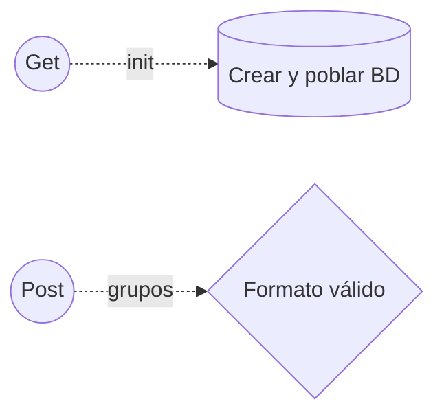
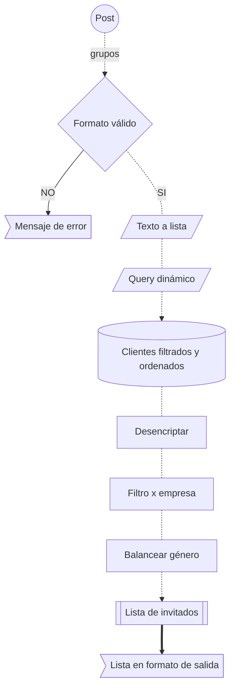

# Codigotón Bancolombia


***Tabla de contenido***

- [Codigotón Bancolombia](#codigotón-bancolombia)
  - [Descripción](#descripción)
  - [Instalación y uso](#instalación-y-uso)
  - [Proceso Desarrollo](#proceso-desarrollo)
  - [Créditos](#créditos)

## Descripción

Codigotón Grupo Bancolombia

## Instalación y uso

*Prerequisitos:*

- Docker

*Herramientas:*

- IDE de su preferencia, recomendado: **vscode**
- Navegador web de su preferencia, recomendado: **Google Chrome**

*Inicialización:*

- Clonar repositorio

```bash
#Utilizando github cli
gh repo clone Joredjs/bancolombia-hackaton

#Con git a través de https
https://github.com/Joredjs/bancolombia-hackaton.git
```

- variables de entorno
  
```bash
#Las llaves debe ser como se especifican a continuación
#Los valores pueden variar según la configuración de entorno local
NODE_PORT=3000
NODE_PORT_LOCAL=13000
NODE_HOST='0.0.0.0'
DB_PORT=3306
DB_PORT_LOCAL=13306
DB_HOST=localhost
DB_USER=root
DB_PASS=test
DB_NAME=evalart_reto
```

- Ejecutar el servicio de docker (*bancolombia-hackaton*) con los 2 contenedores (*bancolombia-hackaton_mysqldb_1* y *bancolombia-hackaton_app_1*)

```bash
cd bancolombia-hackaton
docker-compose build
docker-compose up -d
```

- Inicializar la información en la base de datos de datos
  - Abrir en un navegador web **<http://localhost:13000/init>**, el puerto *"13000"* puede variar según la configuración de las variables de entorno

## Proceso Desarrollo

- Se crea un servicio (get) para ingresar la información en la base de datos, en caso de que esta no exista.

```bash
curl -i -X GET \
 'http://localhost:13000/init'
```

- Se crea un servicio (post) que recibe como parámetro de entrada un texto plano en el formato facilitado, respondiendo la información en texto plano con el formato solicitado

```bash
curl -i -X POST \
   -H "Content-Type:text/plain" \
   -d \
'<General>
TC:1
<Mesa 1>
UG:2
RI:500000
<Mesa 2>
UG:1
RF:500000
<Mesa 3>
UG:3
TC:5
RF:10000
<Mesa 4>
UG:1
RF:100000
<Mesa 5>
UG:99
<Mesa 6>
TC:11
RI:10000' \
 'http://localhost:13000/grupos'
```

Dentro de este servicio se ejecutan varios procesos que se explican a continuación:

1. Se valida que la información enviada en el sea correcta tanto estructuralmente comoen contenido permitido
2. Se transforma en texto plano en una lista de mesas para poder operar sobre ellas posteriormente
3. Se toman los diferentes parámetros de filtrado y se genera un query dinámico por cada mesa
4. Con este query por mesa se genera una consulta a la base de datos, donde se obtiene la información de los clientes, filtrado por los parametros ingresados en el formato de entrada y ordenado por balance (descendente) y código de cliente (descendente) respectivamente
5. Se desencripta el código del cliente en caso de ser necesario
6. Se realiza un filtrado adicional para garantizar que en la misma mesa no estén invitados más de 1 persona de la misma empresa
7. Con el listado filtrado de personas se realiza una organización por género, para que, en caso de que se pueda repartir de manera equitativa, la mesa quede distribuida en cuanto género se refiere (mitad Hombres y mitad Mujeres), en caso de que la cantidad de personas de un género se menor a la mitad de puestos disponibles, se invitarán a todas las personas de este género y se completaran los cupos con las personas del otro género con el orden que se mecionó en el punto 4.
8. Se recorta la lista de invitados para que no se pase del tope máximo de asientos disponibles
9. Salida





## Créditos

**[Jorge Garay](https://github.com/Joredjs)**


